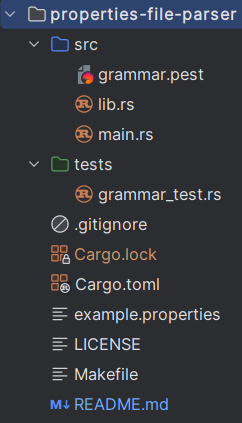

# properties-file-parser
## Overview
### Brief description
This is a project for .properties file parsing (https://en.wikipedia.org/wiki/.properties) \
This project is uploaded on crates.io:\
https://crates.io/crates/properties-file-parser
### .properties
.properties is a file extension used by Java technologies.\
This extension is similar to .ini\
Example of syntax:

```
name="John"
familyName="Smith"

# Age in years
age="35"
```
In property *age="35"*, for example, *age* is property key, *"35"* is value.\
*# Age in years* is comment. \
\
Instead of *=*, you can also use *:* or empty space in property:
```
name: "John"
familyName "Smith"
```
Keys can have no value: 
```
familyName
```
Comments can also start with *!*:
```
! Age in years
```
Tabs and spaces at the beginning of line or between
key and value are ignored, so this syntax is also viable:
```
name    = "John"
    familyName="Smith"
    # Age in years
age=     "35"
```
### Goal
This project's main purpose is to allow Rust users to parse 
.properties and use the results in their own code.
## Project structure
The project structure is following: \

### grammar.pest
File which includes all pest grammar
### lib.rs
Contains the code to parse .properties \
It has methods parse_properties and parse_properties_as_string to parse 
string as a vector of properties as Rust structure and convert it to readable format
### main.rs
Contains the code for CLI. The commands are following:
```
parse [INPUT_FILE_NAME]
// parses the contents of .properties file and shows readable result

parse [INPUT_FILE_NAME] [OUTPUT_FILE_NAME]
// parses the contents of .properties file and stores the readable result in file

help
// shows help
```
### grammar_tests.rs
Contains the tests for the grammar
## Pest
This project is created with pest crate.
The pest grammar is following:
### comment
Parses comment, which can start with # or ! 
### spaces
One or more spaces or tabs
### property
property, such as:
```
key=value
key:value
key value
key
```
### key
key in property
### value
value in property
### file
parses the whole file .properties
### silentEOI
used in order not to get "EOI" in output